<div align="center">

# NzolaNet

**Rede social académica e corporativa** — SPA Angular + REST API ASP.NET Core + SQL Server

[](https://angular.dev/)
[](https://dotnet.microsoft.com/)
[](https://www.microsoft.com/sql-server)
[](https://www.typescriptlang.org/)
[](https://dotnet.microsoft.com/apps/aspnet/signalr)
[](https://playwright.dev/)
[](https://www.w3.org/WAI/WCAG21/quickref/)

Desenvolvido pelo **Grupo LODA** · Cadeira de **Aplicações Web (AW)** · **ISPTEC**

[Funcionalidades](#funcionalidades) ·
[Arquitetura](#arquitetura) ·
[Instalação](#instalacao-e-execucao) ·
[Relatório PDF](#relatorio-academico) ·
[Testes](#testes) ·
[API](#api-rest) ·
[Equipa](#equipa)

</div>

---

## Índice

- [Sobre o projecto](#sobre-o-projecto)
- [Contexto académico](#contexto-academico)
- [Destaques](#destaques)
- [Stack tecnológica](#stack-tecnologica)
- [Arquitetura](#arquitetura)
- [Design e experiência](#design-e-experiencia)
- [Funcionalidades](#funcionalidades)
- [Fimbu — assistente de IA](#fimbu)
- [Mensagens e chat em tempo real](#mensagens)
- [Painel de administração](#administracao)
- [Fluxos principais](#fluxos-principais)
- [Layout responsivo](#layout-responsivo)
- [Segurança](#seguranca)
- [Estrutura do repositório](#estrutura-do-repositorio)
- [Base de dados](#base-de-dados)
- [API REST](#api-rest)
- [Instalação e execução](#instalacao-e-execucao)
- [Configuração](#configuracao)
- [Relatório académico (PDF)](#relatorio-academico)
- [Testes](#testes)
- [Limitações conhecidas](#limitacoes-conhecidas)
- [Equipa](#equipa)

---

<a id="sobre-o-projecto"></a>

## Sobre o projecto

O **NzolaNet** é uma plataforma de rede social inspirada em experiências modernas de microblogging, concebida para ambientes **académicos e corporativos**. Combina uma **Single Page Application (SPA)** em Angular com uma **Web API RESTful** em ASP.NET Core, persistência relacional em **SQL Server**, autenticação **stateless via JWT** e comunicação em tempo real com **SignalR**.

O objectivo é demonstrar boas práticas de engenharia de software: separação em camadas, API documentada, interface responsiva com acessibilidade, testes E2E automatizados, regras de privacidade semelhantes às de redes sociais reais e funcionalidades avançadas como **mensagens directas**, **assistente de IA (Fimbu)** e **painel administrativo** com moderação.

### Mapa de funcionalidades

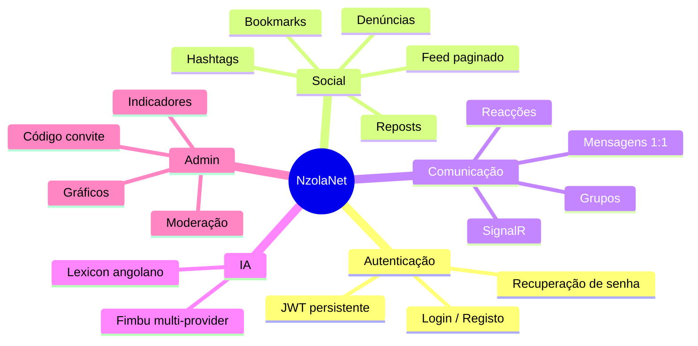

---

<a id="contexto-academico"></a>

## Contexto académico

| Campo | Detalhe |
|-------|---------|
| **Instituição** | ISPTEC — Instituto Superior Politécnico de Tecnologias e Ciências |
| **Curso** | 3.º ano — Engenharia Informática |
| **Cadeira** | AW — Aplicações Web |
| **Docente** | Sediangani Sofrimento |
| **Projecto** | Rede social web com Angular, ASP.NET Web API e SQL Server |
| **Relatório** | PDF gerado automaticamente — ver [Relatório académico](#relatorio-academico) |

---

<a id="destaques"></a>

## Destaques

| Área | O que o NzolaNet oferece |
|------|--------------------------|
| **Autenticação** | Registo, login JWT, sessão persistente, alteração e recuperação de senha |
| **Publicações** | CRUD, imagem/vídeo, feed paginado, scroll infinito, reposts, hashtags |
| **Interacções** | Baze (like), comentários com media, bookmarks, denúncias, notificações |
| **Mensagens** | DM, grupos, media, reacções, editar/apagar, encaminhar — **SignalR** |
| **Fimbu** | Assistente de IA integrada, multi-provider, lexicon angolano |
| **Privacidade** | Perfis públicos/privados, pedidos de seguimento com aprovação |
| **Admin** | Painel `/admin` com indicadores, gráficos, moderação e código de convite |
| **UI/UX** | Tema Carbon Aurora, modo claro/escuro, animações GSAP, skeleton loading |
| **Mobile** | Bottom navigation, topbar no feed, safe-area, modais sheet |
| **Acessibilidade** | Focus trap, ARIA, navegação por teclado, alvos tácteis ≥ 44 px |
| **Segurança** | Uploads autenticados, media com regras de privacidade, CORS, roles Admin |
| **Qualidade** | 22 testes E2E Playwright (desktop + mobile viewport) |

---

<a id="stack-tecnologica"></a>

## Stack tecnológica

### Frontend

| Tecnologia | Uso |
|------------|-----|
| **Angular 20** | SPA standalone, lazy routes, signals-ready |
| **TypeScript** | Tipagem forte em serviços, modelos e componentes |
| **SCSS + CSS Variables** | Design tokens, temas, breakpoints |
| **GSAP** | Animações de entrada, modais, confetti no baze |
| **RxJS** | Streams reactivos nos serviços |
| **SignalR Client** | Chat e métricas admin em tempo real |
| **Chart.js** | Gráficos no painel administrativo |
| **Playwright** | Testes E2E desktop e mobile |

### Backend

| Tecnologia | Uso |
|------------|-----|
| **ASP.NET Core 10** | Web API, middleware, DI, SignalR hubs |
| **Entity Framework Core 8** | ORM, migrations, SQL Server |
| **ASP.NET Identity** | Utilizadores, roles, hash de senhas |
| **JWT Bearer** | Autenticação stateless (utilizador + admin) |
| **Swagger / OpenAPI** | Documentação interactiva da API |

### Infraestrutura

| Tecnologia | Uso |
|------------|-----|
| **SQL Server Express** | Base de dados relacional |
| **wwwroot/uploads** | Armazenamento de ficheiros (servidos via API autenticada) |
| **Providers IA** | OpenRouter, Google AI, Groq, NVIDIA (Fimbu) |

---

<a id="arquitetura"></a>

## Arquitetura

### Visão geral do sistema

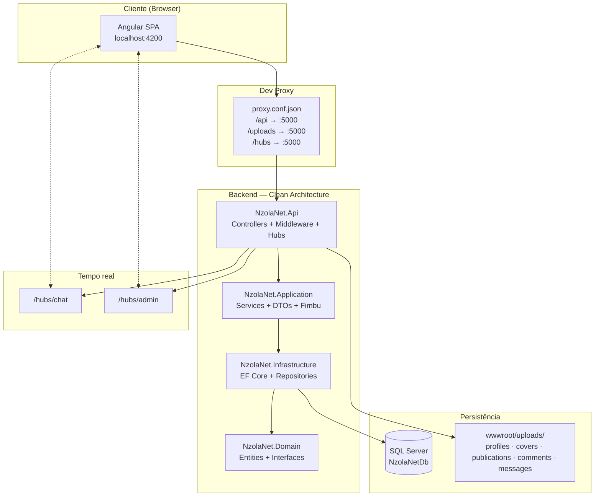

### Camadas do backend

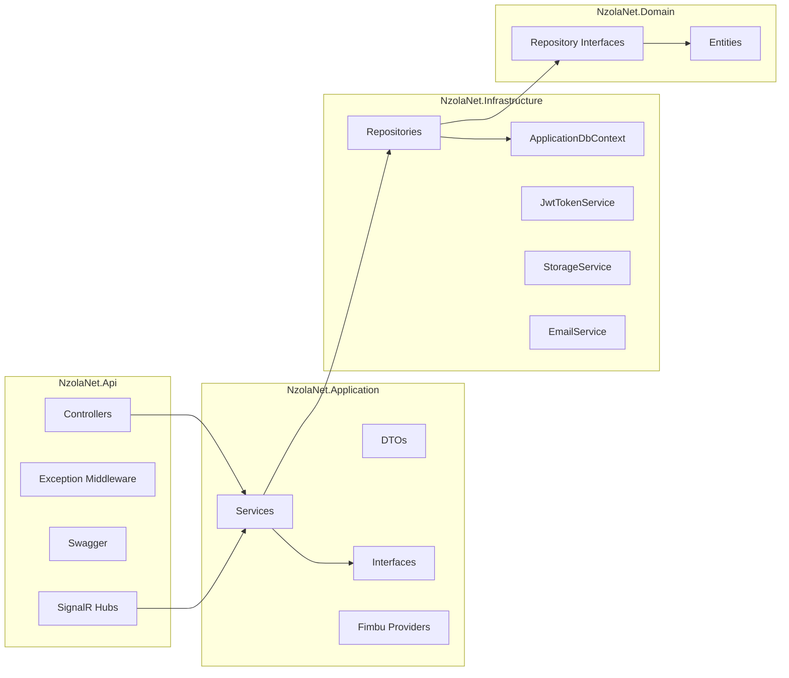

| Camada | Responsabilidade |
|--------|------------------|
| **NzolaNet.Domain** | Entidades, contratos de repositório e regras de domínio |
| **NzolaNet.Application** | Regras de negócio, DTOs, serviços, providers Fimbu |
| **NzolaNet.Infrastructure** | EF Core, repositórios, Identity, JWT, email, armazenamento |
| **NzolaNet.Api** | Endpoints HTTP, hubs SignalR, CORS, autenticação, pipeline de erros |

### Frontend — organização

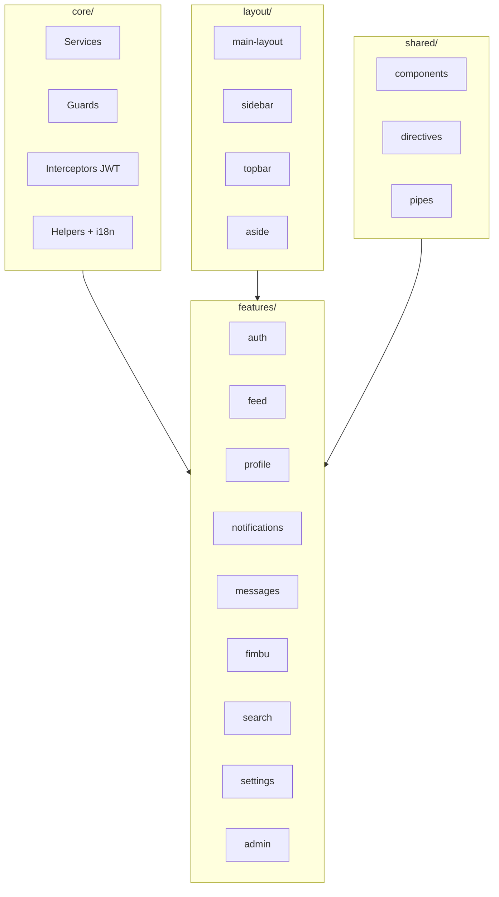

### Rotas principais

| Área | Rotas |
|------|-------|
| **Auth (guest)** | `/login`, `/register`, `/forgot-password`, `/reset-password` |
| **App autenticada** | `/feed`, `/search`, `/notifications`, `/messages`, `/messages/:id`, `/fimbu`, `/bookmarks`, `/settings`, `/profile/me`, `/profile/:id`, `/publicacoes/:id` |
| **Admin** | `/admin/login`, `/admin/register`, `/admin` |
| **Aliases PT** | `/pesquisar` → `/search`, `/perfil/me` → `/profile/me`, `/notificacoes` → `/notifications` |

---

<a id="design-e-experiencia"></a>

## Design e experiência

### Tema visual — *Carbon Aurora & Glassmorphic Twilight*

| Token | Valor | Uso |
|-------|-------|-----|
| Canvas | `#07080A` | Fundo principal (modo escuro) |
| Superfícies | `#0F1011` | Cartões com blur e bordas translúcidas |
| Accent | `#7170FF` | Acções primárias, links activos |
| Engajamento | `#EC4899` | Baze, destaques de interacção |
| Tipografia | **Inter** | Corpo e interface |

- Modo **claro** e **escuro** com persistência em `localStorage`
- **Skeleton shimmer** durante carregamento do feed (com suporte a `prefers-reduced-motion`)
- **Transições de rota** animadas sem flash de conteúdo
- **Confetti** no baze (desactivado com animações reduzidas no SO)
- Interface em **português de Portugal** (`pt-PT`)

### Animações e micro-interacções

| Componente | Comportamento |
|------------|---------------|
| `AnimationService` | GSAP: enter, modal, likePop; durações mais curtas em mobile |
| `RouteTransitionService` | Fade/slide entre rotas; reset de scroll |
| `PressScaleDirective` | Feedback táctil em botões mobile |
| `ProfileParallaxDirective` | Parallax suave na capa do perfil |
| `EnterAnimationDirective` | Stagger de entrada nos cards do feed |

---

<a id="funcionalidades"></a>

## Funcionalidades

### Autenticação e conta

- [x] Registo com validação de email e username únicos
- [x] Login com JWT (Bearer) — duração configurável (7 dias por defeito)
- [x] Endpoint `/api/auth/me` para dados da sessão
- [x] Alteração de senha (utilizador autenticado)
- [x] Recuperação de senha — `forgot-password` + `reset-password` (email em dev via log)
- [x] Ecrã de boas-vindas `/welcome` com personalidade da Fimbu
- [x] Guards `authGuard` / `guestGuard` nas rotas

### Perfil e privacidade

- [x] Bio, foto de perfil, foto de capa
- [x] Perfil **público** ou **privado**
- [x] Seguir / deixar de seguir
- [x] Pedidos de seguimento com **aprovação** ou **rejeição**
- [x] Tabs: publicações, media, bazes, repartilhas
- [x] Perfil por username (`/profile/by-username/:username`)
- [x] Parallax na capa; avatar com fallback por inicial

### Publicações e feed

- [x] Criar publicação (texto, imagem e/ou vídeo — até 50 MB)
- [x] Editar e eliminar (apenas autor)
- [x] Feed **Para ti** (global com filtro de privacidade no SQL)
- [x] Feed **A seguir** (utilizadores seguidos + próprio)
- [x] Paginação com `hasMore` correcto para contas privadas
- [x] Scroll infinito com throttle
- [x] Página dedicada `/publicacoes/:id` com thread embedded
- [x] Resume de vídeo via query `?media=1&t=segundos`
- [x] **Reposts** com ou sem texto adicional (quote repost)
- [x] **Bookmarks** — guardar publicações em `/bookmarks`
- [x] **Hashtags** — trending e pesquisa por hashtag
- [x] **Denúncias** — reportar publicações e comentários

### Interacções

- [x] **Baze** (like) com toggle e contador
- [x] Notificação de baze removida ao fazer unlike
- [x] Comentários com texto, imagem ou vídeo
- [x] Notificações: baze, comentário, follow, pedido, aceite, recusado, repost, menção, mensagem
- [x] Badge de não lidas na navegação
- [x] Links no texto da publicação (linkificação segura)

### Pesquisa e descoberta

- [x] Pesquisa de utilizadores, publicações e hashtags (`/search`)
- [x] Sugestões **Quem seguir** (aside desktop ≥ 1280 px)
- [x] Painel de **tendências** com hashtags populares
- [x] Seguir directamente a partir dos resultados

### Definições

- [x] Secção **Conta** — dados pessoais editáveis
- [x] Secção **Privacidade** — perfil público ou privado
- [x] Secção **Palavra-passe** — alteração de senha

### Acessibilidade (a11y)

- [x] Focus trap com **stack** para overlays aninhados
- [x] Restore de foco ao fechar modais e menu da conta
- [x] Navegação por setas no menu da conta
- [x] ARIA em tabs, botões de acção e navegação mobile
- [x] Sem botões HTML aninhados
- [x] Contraste alinhado a WCAG 2.1 AA no tema escuro

---

<a id="fimbu"></a>

## Fimbu — assistente de IA

A **Fimbu** é a assistente de inteligência artificial integrada na NzolaNet, acessível em `/fimbu`.

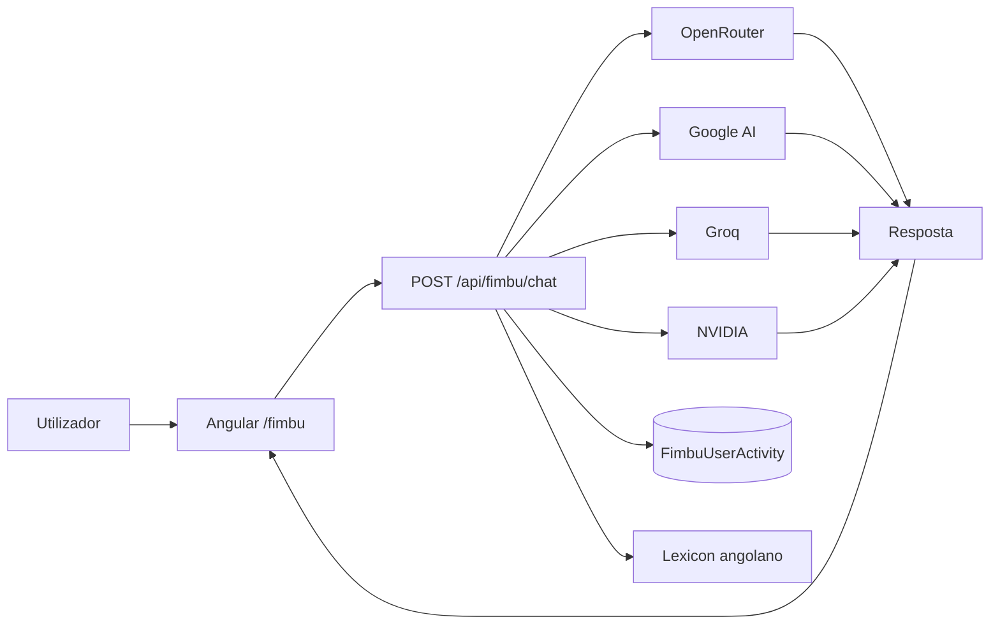

| Capacidade | Detalhe |
|------------|---------|
| **Histórico** | Conversas persistidas por utilizador |
| **Multi-provider** | Fallback automático entre fornecedores |
| **Lexicon** | Vocabulário angolano para respostas contextualizadas |
| **Personalidade** | Sorteada no registo/login |
| **Admin** | Contadores de actividade da Fimbu no painel |

**Endpoints:** `GET /api/fimbu/history` · `POST /api/fimbu/chat` · `DELETE /api/fimbu/history`

---

<a id="mensagens"></a>

## Mensagens e chat em tempo real

A secção **Mensagens** (`/messages`) está totalmente implementada — não é placeholder.

| Funcionalidade | Detalhe |
|----------------|---------|
| **Conversas directas** | Mensagens 1:1 entre utilizadores |
| **Grupos** | Criação de grupos com vários participantes |
| **Media** | Envio de imagens e ficheiros |
| **Reacções** | Emoji reactions nas mensagens |
| **Edição / eliminação** | Apagar para si ou para todos |
| **Encaminhar** | Forward de mensagens |
| **Tempo real** | SignalR hub `/hubs/chat` |
| **Notificações** | Badge unread + tipos `message`, `chat_mention`, `group_added` |

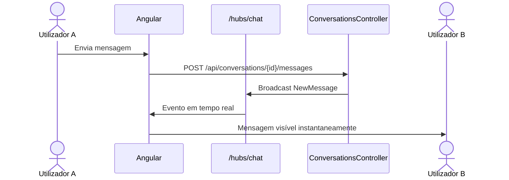

---

<a id="administracao"></a>

## Painel de administração

O painel admin vive em **`/admin`** (login em `/admin/login`, registo em `/admin/register`).

### Código de convite de administrador

O registo de administradores é protegido por um **código de convite**. Sem o código correcto, a API rejeita o pedido com *«Código de administrador inválido»*.

| Origem | Valor |
|--------|-------|
| **Código por defeito** | `NZOLA-ADMIN-2026` |
| **Configuração** | `AdminSettings:RegistrationCode` em `appsettings.json` |
| **Override (produção)** | Variável de ambiente `NZOLANET_ADMIN_CODE` |

> O registo normal em `/register` **não** exige este código — apenas o registo admin.

### Funcionalidades do painel

| Secção | Descrição |
|--------|-----------|
| **Indicadores** | Métricas gerais da plataforma (utilizadores, publicações, actividade) |
| **Gráficos** | Visualização Chart.js com evolução temporal |
| **Moderação** | Publicações e comentários denunciados — remover ou dispensar |
| **Utilizadores** | Lista e gestão de contas |
| **Tempo real** | SignalR hub `/hubs/admin` para actualização de métricas |

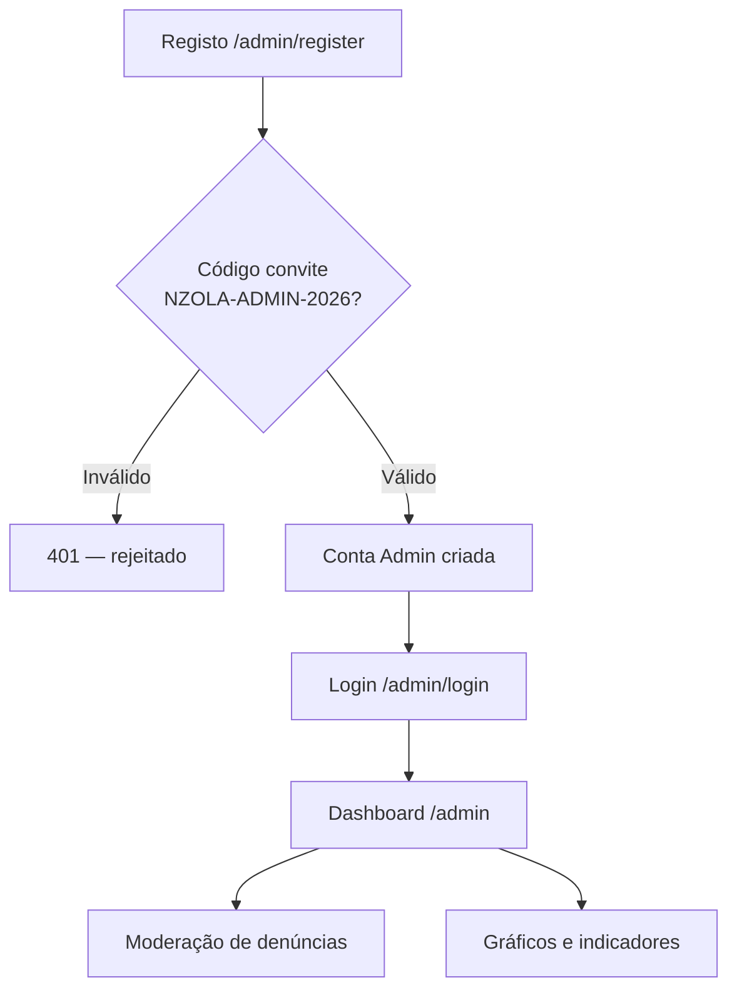

**Endpoints admin:** `POST /api/admin/login` · `POST /api/admin/register` · `GET /api/admin/metrics` · moderação de reports

---

<a id="fluxos-principais"></a>

## Fluxos principais

### Autenticação

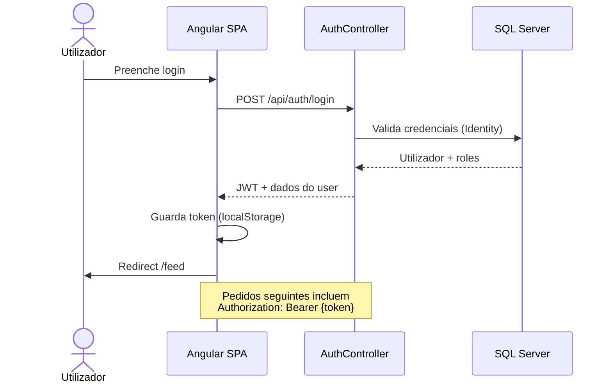

### Seguimento de perfil privado

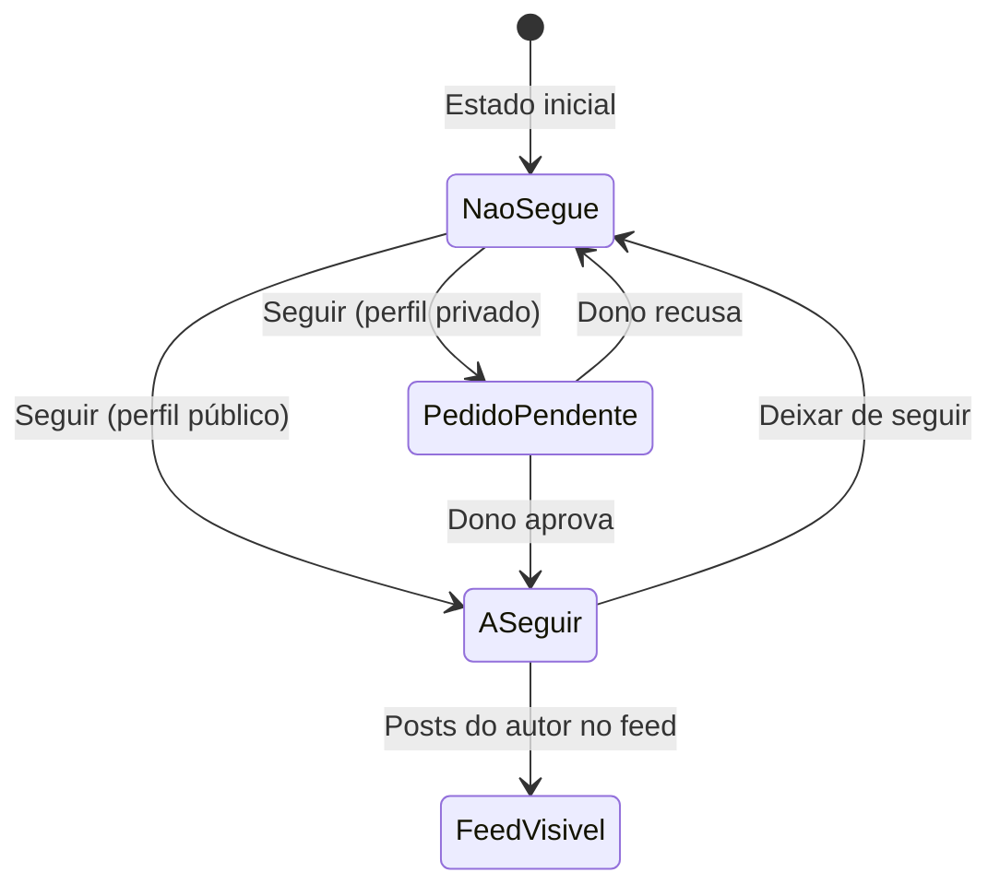

### Ciclo de vida de uma publicação

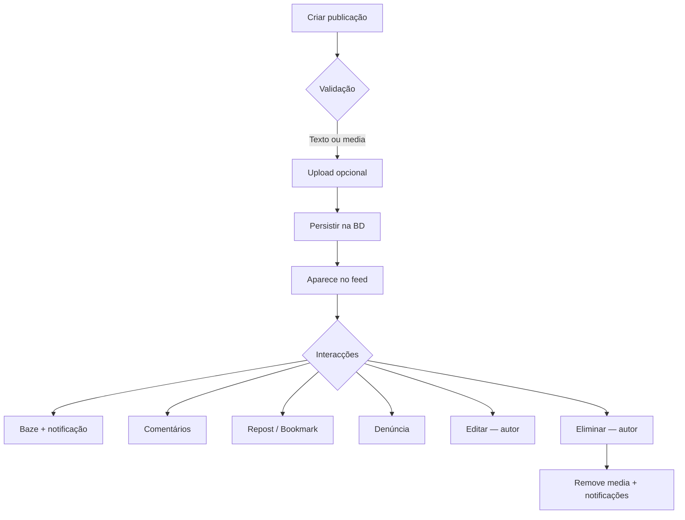

### Servir ficheiros de upload

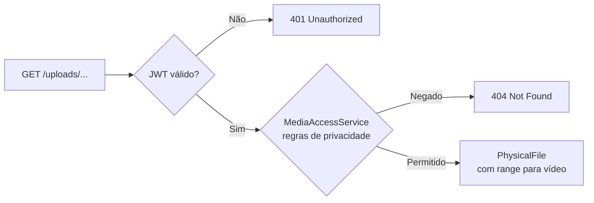

---

<a id="layout-responsivo"></a>

## Layout responsivo

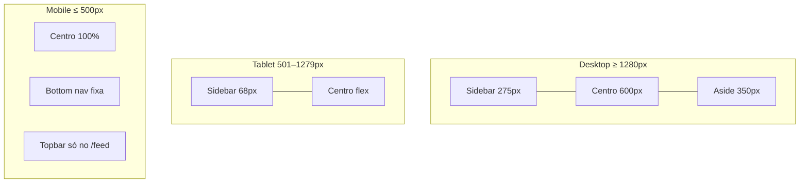

| Breakpoint | Comportamento |
|------------|---------------|
| `≤ 500px` | Bottom navigation (feed, search, fimbu, notificações, mensagens), modal sheet, safe-area insets |
| `≤ 988px` | Sidebar colapsada (ícones) |
| `≤ 1279px` | Aside (Quem seguir) oculto — pesquisa via `/search` |
| `≥ 1280px` | Layout completo em 3 colunas |

---

<a id="seguranca"></a>

## Segurança

| Medida | Implementação |
|--------|---------------|
| **Autenticação** | JWT Bearer; chave via `NZOLANET_JWT_KEY` ou `JwtSettings:Key` |
| **Autorização** | Roles `User` / `Admin`; guards no frontend |
| **Admin isolado** | Sessão JWT separada para o painel admin |
| **Código convite** | Registo admin exige `AdminSettings:RegistrationCode` |
| **Uploads** | Sem `UseStaticFiles` público; `UploadsController` + `MediaAccessService` |
| **Media privada** | Posts/comentários de perfis privados só para seguidores aprovados |
| **CORS** | Política `AllowAngular`; origens configuráveis |
| **Senhas** | ASP.NET Identity com requisitos mínimos |
| **Erros** | `ExceptionMiddleware` global — respostas consistentes |
| **Path traversal** | Validação em paths de upload (`..` rejeitado) |
| **Denúncias** | Fluxo de moderação admin para conteúdo reportado |

---

<a id="estrutura-do-repositorio"></a>

## Estrutura do repositório

```
NzolaNet/
├── backend/
│   ├── NzolaNet.Api/              # Controllers, Hubs, Program.cs, Swagger
│   ├── NzolaNet.Application/      # Services, DTOs, Fimbu providers
│   ├── NzolaNet.Domain/           # Entidades, contratos
│   └── NzolaNet.Infrastructure/   # EF Core, repos, Identity, JWT, email
├── frontend/
│   ├── src/app/
│   │   ├── core/                  # Services, guards, interceptors, i18n
│   │   ├── features/              # Páginas por domínio
│   │   ├── layout/                # Shell, sidebar, topbar
│   │   └── shared/                # Componentes reutilizáveis
│   ├── e2e/                       # Playwright (desktop + mobile)
│   ├── scripts/
│   │   ├── run-e2e.js             # Orquestrador E2E
│   │   └── generate-report.mjs    # Relatório PDF académico
│   ├── mock-backend.js            # Mock para E2E
│   └── proxy.conf.json            # Proxy dev → API :5000
├── docs/
│   ├── database/                  # schema.sql, erd.md
│   ├── relatorio-nzolanet.pdf     # Relatório (gerado localmente)
│   ├── relatorio-nzolanet.html    # Versão HTML do relatório
│   └── report-assets/             # 27 screenshots do relatório
├── palavras_angolanas/            # Lexicon da Fimbu
├── postgres/                      # Variante cloud: Postgres + Render + Vercel (ver postgres/README.md)
└── README.md
```

> **Nota:** Pastas locais como `extras/` (enunciado, referências) e `.cursor/` estão no `.gitignore` e não fazem parte do repositório remoto.

> **Hospedagem gratuita:** a pasta [`postgres/`](./postgres/README.md) é uma cópia independente com **PostgreSQL (Npgsql)** para deploy em Supabase + Render + Vercel. A raiz deste repo continua em **SQL Server** e não é alterada por essa variante.

---

<a id="base-de-dados"></a>

## Base de dados

O esquema relacional inclui utilizadores (Identity), publicações, comentários, likes, seguimentos, notificações, **mensagens**, **reposts**, **bookmarks**, **denúncias** e **actividade Fimbu**.

Documentação SQL (tabelas base):

- [`docs/database/schema.sql`](docs/database/schema.sql) — DDL SQL Server
- [`docs/database/erd.md`](docs/database/erd.md) — diagrama entidade-relacionamento

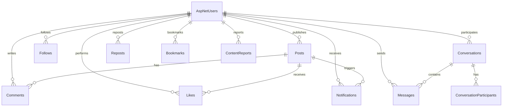

| Entidade | Descrição |
|----------|-----------|
| `Conversation` / `ConversationParticipant` | Conversas directas e de grupo |
| `Message` / `MessageReaction` | Mensagens, reacções e ocultação |
| `Repost` | Repartilhas de publicações |
| `Bookmark` | Publicações guardadas |
| `ContentReport` | Denúncias de publicações/comentários |
| `PlatformCounter` / `FimbuUserActivity` | Métricas admin e actividade IA |

As **migrations** EF Core são aplicadas automaticamente no arranque da API.

---

<a id="api-rest"></a>

## API REST

Base URL em desenvolvimento: `http://localhost:5000`

| Grupo | Prefixo | Exemplos |
|-------|---------|----------|
| Autenticação | `/api/auth` | `login`, `register`, `me`, `change-password`, `forgot-password`, `reset-password` |
| Utilizadores | `/api/users` | `search`, `suggestions`, `{id}/follow`, `follow-requests`, `me/bookmarks` |
| Publicações | `/api/publications` | `feed`, CRUD, `{id}/like`, `{id}/repost`, `{id}/bookmark`, `{id}/report`, `trending-hashtags` |
| Comentários | `/api/comments` | CRUD, `{id}/report` |
| Notificações | `/api/notifications` | listar, marcar lidas, unread-count, eliminar |
| Conversas | `/api/conversations` | CRUD, grupos, mensagens, media, reacções, forward, read |
| Fimbu | `/api/fimbu` | `history`, `chat`, `DELETE history` |
| Uploads | `/uploads` | `GET /uploads/{path}` *(autenticado)* |
| Admin | `/api/admin` | `login`, `register`, `metrics`, moderação, utilizadores |
| SignalR | `/hubs/chat`, `/hubs/admin` | tempo real chat + métricas admin |

**Swagger UI:** `http://localhost:5000/swagger` *(ambiente Development)*

O frontend usa `environment.apiUrl: '/api'` com proxy em desenvolvimento (`proxy.conf.json`).

---

<a id="instalacao-e-execucao"></a>

## Instalação e execução

### Pré-requisitos

| Ferramenta | Versão mínima |
|------------|---------------|
| [.NET SDK](https://dotnet.microsoft.com/download) | 10.x |
| [Node.js LTS](https://nodejs.org/) | 20.x |
| SQL Server Express ou LocalDB | Qualquer edição recente |
| Git | Qualquer |

### 1. Clonar o repositório

```bash
git clone <url-do-repositorio>
cd NzolaNet
```

### 2. Configurar variáveis de ambiente (backend)

```powershell
# PowerShell — obrigatório para JWT
$env:NZOLANET_JWT_KEY="sua-chave-secreta-com-pelo-menos-32-caracteres"

# Opcional — override do código de convite admin
$env:NZOLANET_ADMIN_CODE="NZOLA-ADMIN-2026"

# Opcional — chaves dos providers Fimbu
$env:NZOLANET_FIMBU_OPENROUTER_KEY="sua-chave"
```

```bash
# Bash / macOS / Linux
export NZOLANET_JWT_KEY="sua-chave-secreta-com-pelo-menos-32-caracteres"
export NZOLANET_ADMIN_CODE="NZOLA-ADMIN-2026"
```

Copie `backend/NzolaNet.Api/appsettings.Development.example.json` para `appsettings.Development.json` e preencha JWT, Fimbu e `SeedAdmin` (conta admin inicial).

Ajuste a connection string em `backend/NzolaNet.Api/appsettings.json` se o seu SQL Server não for `.\SQLEXPRESS`.

### 3. Executar o backend

```bash
cd backend/NzolaNet.Api
dotnet restore
dotnet run
```

| Serviço | URL |
|---------|-----|
| API | http://localhost:5000 |
| Swagger | http://localhost:5000/swagger |

### 4. Executar o frontend

Num **segundo terminal**:

```bash
cd frontend
npm install
npm start
```

| Serviço | URL |
|---------|-----|
| Angular SPA | http://localhost:4200 |
| Login | http://localhost:4200/login |
| Admin | http://localhost:4200/admin/login |

O proxy encaminha `/api`, `/uploads` e `/hubs` para a API em `:5000`.

### Scripts úteis (frontend)

| Comando | Descrição |
|---------|-----------|
| `npm start` | Servidor de desenvolvimento |
| `npm run build` | Build de produção |
| `npm run e2e` | 22 testes E2E (mock backend + Angular + Playwright) |
| `npm run start:lan` | Servidor acessível na rede local |
| `npm run start:ngrok` | Configuração para túnel ngrok |

---

<a id="configuracao"></a>

## Configuração

### `appsettings.json` (backend)

| Secção | Descrição |
|--------|-----------|
| `ConnectionStrings:DefaultConnection` | Ligação SQL Server |
| `JwtSettings` | Issuer, Audience, duração do token |
| `AdminSettings:RegistrationCode` | Código de convite admin (`NZOLA-ADMIN-2026`) |
| `Fimbu` | Chaves e modelos dos providers IA |
| `Frontend:BaseUrl` | URL da SPA (links de email) |
| `CorsOrigins` | Origens permitidas em produção |

### `appsettings.Development.json` (local, gitignored)

| Secção | Descrição |
|--------|-----------|
| `SeedAdmin` | Conta administrador inicial (email, username, password) |
| `AppSettings:ExposePasswordResetLink` | Expõe link de reset no log (dev) |
| `Fimbu:*` | Chaves API preenchidas para testes locais |

### Variáveis de ambiente

| Variável | Descrição |
|----------|-----------|
| `NZOLANET_JWT_KEY` | Chave secreta JWT (obrigatória) |
| `NZOLANET_ADMIN_CODE` | Override do código de convite admin |
| `NZOLANET_FIMBU_OPENROUTER_KEY` | Chave OpenRouter |
| `NZOLANET_FIMBU_GOOGLE_AI_KEY` | Chave Google AI |
| `NZOLANET_FIMBU_GROQ_KEY` | Chave Groq |
| `NZOLANET_FIMBU_NVIDIA_KEY` | Chave NVIDIA |

### `environment.ts` (frontend)

| Propriedade | Dev | Produção |
|-------------|-----|----------|
| `apiUrl` | `/api` (proxy) | URL absoluta da API |
| `uploadsUrl` | `''` (proxy) | URL base dos uploads |
| `chatHubUrl` | `/hubs/chat` | URL do hub SignalR |
| `adminHubUrl` | `/hubs/admin` | URL do hub admin |

Ficheiros sensíveis ignorados pelo Git: `appsettings.Development.json`, `environment.ngrok.ts`, `*.env`.

---

<a id="relatorio-academico"></a>

## Relatório académico (PDF)

O projecto inclui um gerador automático de relatório em português de Portugal, com capa, índice, tabelas e **27 capturas de ecrã**.

### Gerar o relatório

```bash
# Requer backend (:5000) e frontend (:4200) activos
cd frontend
node scripts/generate-report.mjs --capture
```

| Flag | Descrição |
|------|-----------|
| `--capture` | Captura screenshots e gera PDF |
| `--skip-capture` | Reutiliza imagens existentes, só regera PDF |
| `--resume-capture` | Salta screenshots que já existem |
| `--admin-only` | Captura apenas ecrãs admin (03, 04, 25–27) |

### Saída

| Ficheiro | Conteúdo |
|----------|----------|
| `docs/relatorio-nzolanet.pdf` | Relatório completo para entrega |
| `docs/relatorio-nzolanet.html` | Versão HTML |
| `docs/report-assets/*.png` | 27 screenshots numeradas |

### Capturas incluídas

| # | Ecrã |
|---|------|
| 1–2 | Login e registo da NzolaNet |
| 3–4 | Login e registo admin |
| 5–24 | Feed, pesquisa, mensagens, Fimbu, perfil, definições, modo escuro |
| 25–27 | Painel admin — indicadores, gráficos, moderação |

---

<a id="testes"></a>

## Testes

### Testes automatizados E2E (Playwright)

```bash
cd frontend
npm run e2e
```

| Projecto | Ficheiro | Testes |
|----------|----------|--------|
| `desktop-chromium` | `e2e/nzolanet.spec.ts` | 13 |
| `mobile-chromium` | `e2e/nzolanet.mobile.spec.ts` | 9 |
| **Total** | | **22** |

O script `run-e2e.js` inicia automaticamente o mock backend, compila o Angular, instala Chromium e executa a suite.

**Cobertura E2E:** tema, login, feed, criar publicação, pesquisa, perfil, notificações, mensagens, rotas, auth inválida, registo, recuperação de senha, baze, bottom nav mobile, topbar, modal publicar, overflow horizontal.

### Testes manuais recomendados

Antes da entrega ou demonstração, validar manualmente:

1. **Privacidade** — duas contas; perfil privado; pedido → aprovação → feed visível
2. **Uploads** — imagem num post; URL sem token → 401; com sessão → visível
3. **Unlike** — baze → notificação; unlike → notificação removida
4. **Mensagens** — DM, grupo, reacções, tempo real com duas sessões
5. **Fimbu** — conversa, histórico, resposta multi-provider
6. **Admin** — login, moderação de denúncia, gráficos
7. **Mobile** — viewport ≤ 500 px; bottom nav; modal sheet; sem scroll horizontal
8. **Tema** — alternar claro/escuro; persistência após F5
9. **A11y** — Tab no modal; Escape fecha; menu conta com setas

### Testes contra API real

Os E2E usam `mock-backend.js`. Para validar integração completa, execute backend + frontend e percorra os fluxos acima com a API .NET activa.

---

<a id="limitacoes-conhecidas"></a>

## Limitações conhecidas

| Item | Estado |
|------|--------|
| Email de recuperação de senha | Funcional em dev (log); requer SMTP configurado em produção |
| E2E mobile | Chromium emulado (Pixel 7); não substitui teste em Safari/iOS real |
| Schema SQL em `docs/database/` | Documenta tabelas base; entidades novas reflectidas nas migrations EF |
| `extras/` | Materiais de referência locais — não versionados no GitHub |
| Relatório PDF | Gerado localmente; requer servidores activos para capturas |

---

<a id="equipa"></a>

## Equipa

**Grupo LODA** — ISPTEC · Aplicações Web · Docente: Sediangani Sofrimento

| Membro | N.º | Área de contribuição |
|--------|-----|----------------------|
| **Willfredy Vieira Dias** | 20200204 | Backend — ASP.NET Core Web API, SQL Server, segurança |
| **Manuel Sulo** | 20221465 | Frontend — feed, notificações, design system, animações |
| **Jeovani Sassombo** | 20220737 | Frontend — publicações, comentários, interacções |
| **Emer Tavares** | 20220633 | Frontend — autenticação, perfil, experiência do utilizador |

---

<div align="center">

**NzolaNet** — *May The Code Be With You*

Desenvolvido com foco em boas práticas de engenharia de software, acessibilidade e experiência responsiva.

</div>
