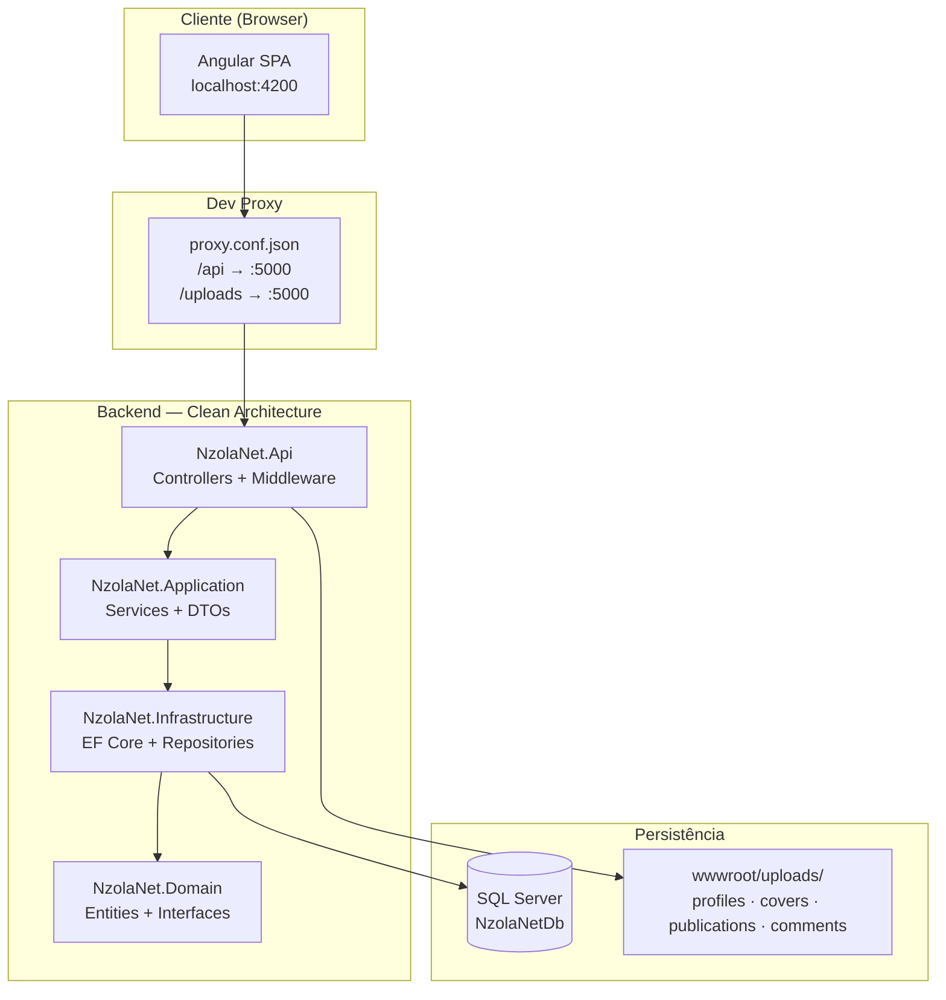
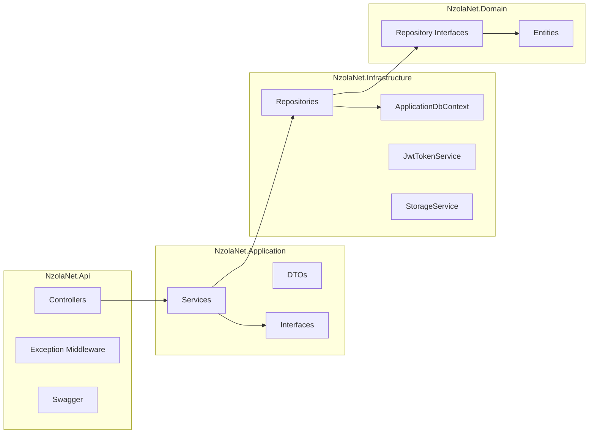
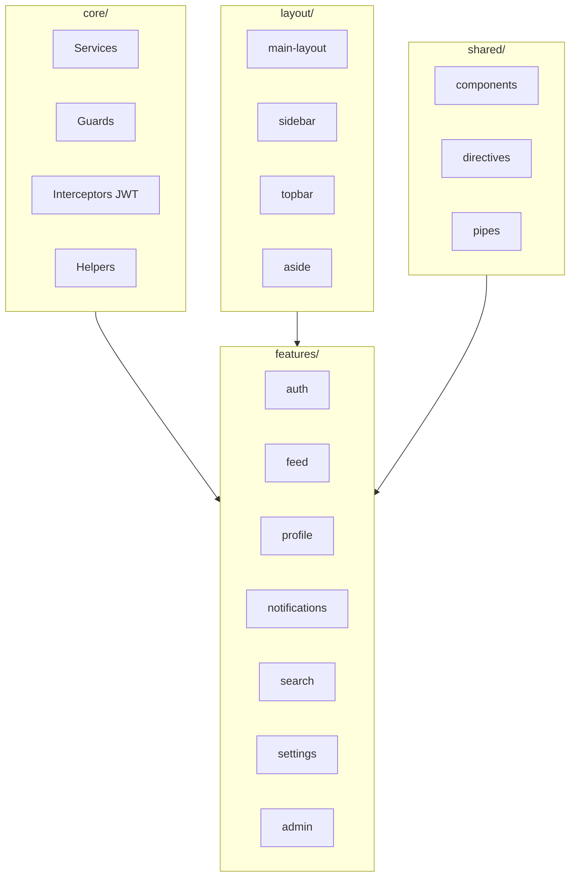
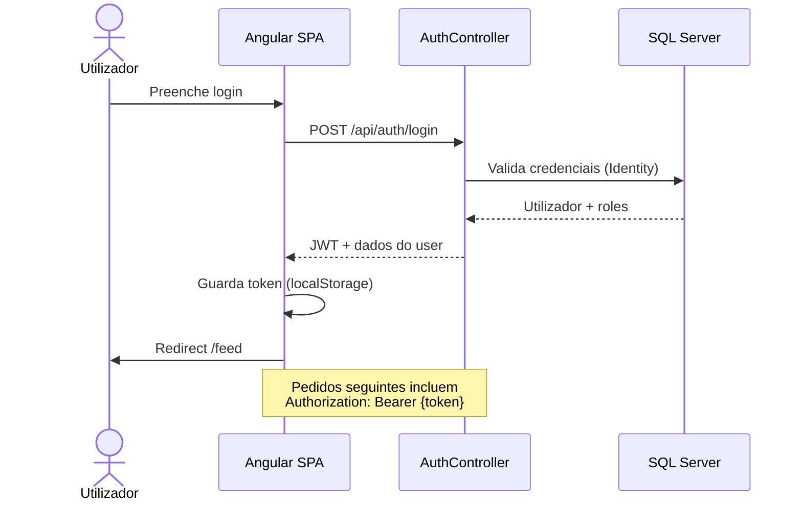
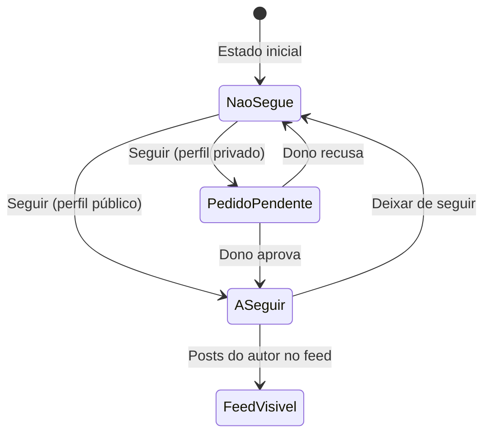
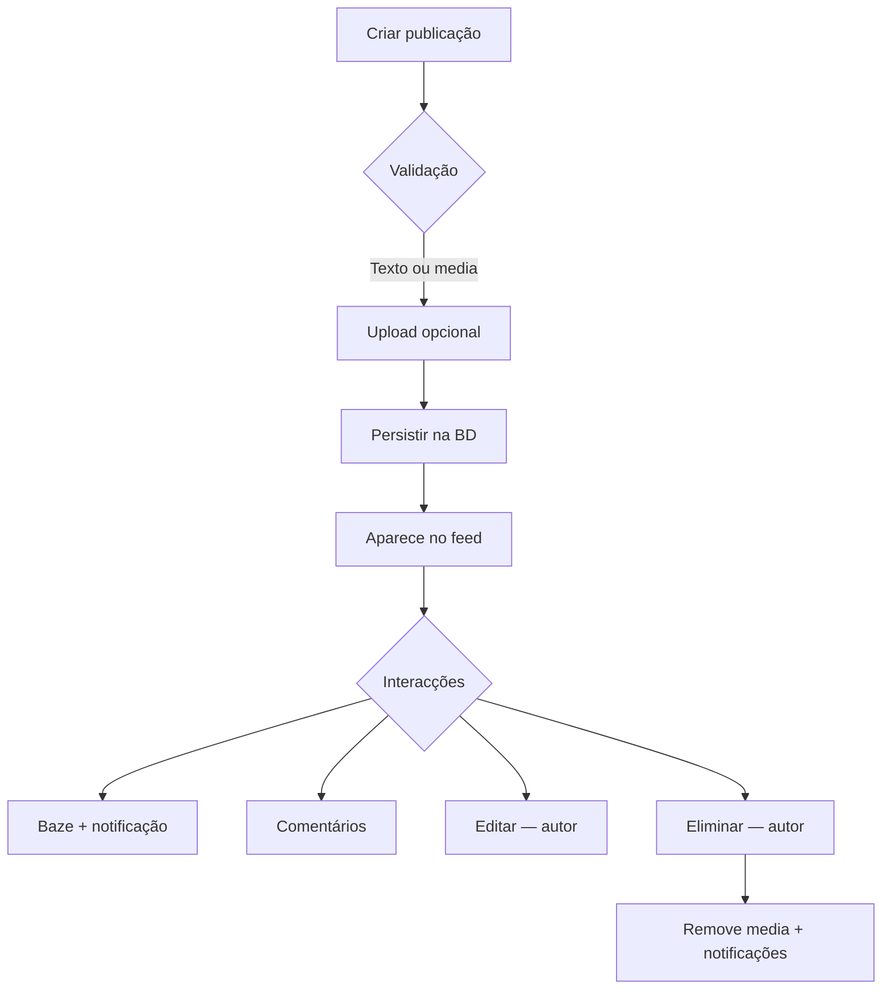
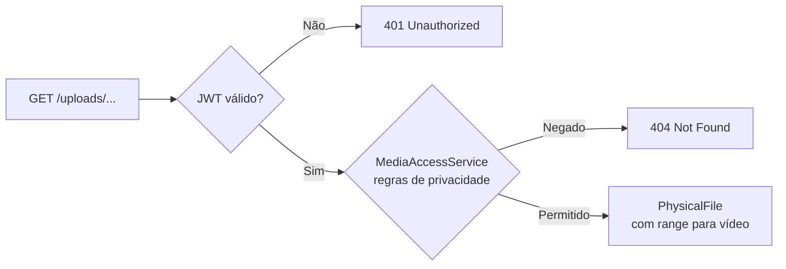
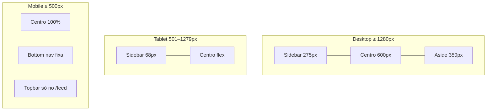
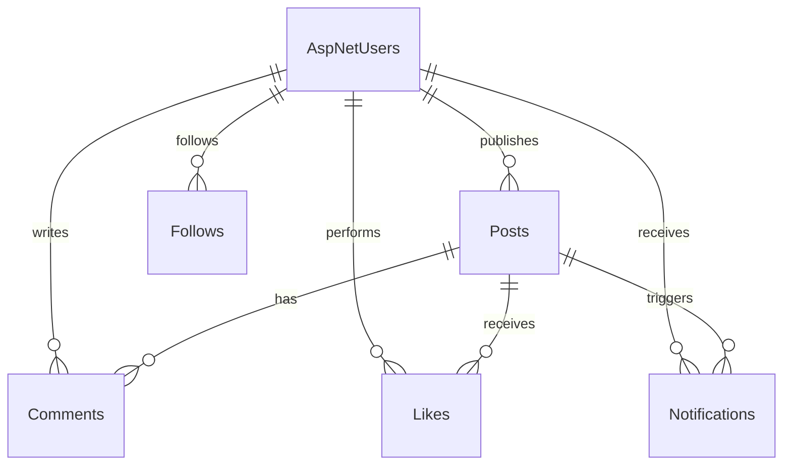

<div align="center">

# NzolaNet

**Rede social académica e corporativa** — SPA Angular + REST API ASP.NET Core + SQL Server

[](https://angular.dev/)
[](https://dotnet.microsoft.com/)
[](https://www.microsoft.com/sql-server)
[](https://www.typescriptlang.org/)
[](https://playwright.dev/)
[](https://www.w3.org/WAI/WCAG21/quickref/)

Desenvolvido pelo **Grupo LODA** · Cadeira de **Aplicações Web** · **ISPTEC**

[Funcionalidades](#funcionalidades) ·
[Arquitetura](#arquitetura) ·
[Instalação](#instalacao-e-execucao) ·
[Testes](#testes) ·
[API](#api-rest) ·
[Equipa](#equipa)

</div>

---

## Índice

- [Sobre o projecto](#sobre-o-projecto)
- [Destaques](#destaques)
- [Stack tecnológica](#stack-tecnologica)
- [Arquitetura](#arquitetura)
- [Design e experiência](#design-e-experiencia)
- [Funcionalidades](#funcionalidades)
- [Fluxos principais](#fluxos-principais)
- [Layout responsivo](#layout-responsivo)
- [Segurança](#seguranca)
- [Estrutura do repositório](#estrutura-do-repositorio)
- [Base de dados](#base-de-dados)
- [API REST](#api-rest)
- [Instalação e execução](#instalacao-e-execucao)
- [Configuração](#configuracao)
- [Testes](#testes)
- [Limitações conhecidas](#limitacoes-conhecidas)
- [Equipa](#equipa)

---

<a id="sobre-o-projecto"></a>

## Sobre o projecto

O **NzolaNet** é uma plataforma de rede social inspirada em experiências modernas de microblogging, concebida para ambientes **académicos e corporativos**. Combina uma **Single Page Application (SPA)** em Angular com uma **Web API RESTful** em ASP.NET Core, persistência relacional em **SQL Server** e autenticação **stateless via JWT**.

O objectivo é demonstrar boas práticas de engenharia de software: separação em camadas, API versionada e documentada, interface responsiva com acessibilidade, testes E2E automatizados e regras de negócio de privacidade semelhantes às de redes sociais reais.

---

<a id="destaques"></a>

## Destaques

| Área | O que o NzolaNet oferece |
|------|--------------------------|
| **Autenticação** | Registo, login JWT, sessão persistente, alteração de senha |
| **Publicações** | CRUD, imagem/vídeo, feed paginado, scroll infinito, detalhe com thread |
| **Interacções** | Baze (like) com feedback visual, comentários com media, notificações |
| **Privacidade** | Perfis públicos/privados, pedidos de seguimento com aprovação |
| **UI/UX** | Tema Carbon Aurora, modo claro/escuro, animações GSAP, skeleton loading |
| **Mobile** | Bottom navigation, topbar no feed, safe-area, modais sheet |
| **Acessibilidade** | Focus trap, ARIA, navegação por teclado, alvos tácteis ≥44px |
| **Segurança** | Uploads autenticados, media com regras de privacidade, CORS, roles Admin |
| **Qualidade** | 21 testes E2E Playwright (desktop + mobile viewport) |

---

<a id="stack-tecnologica"></a>

## Stack tecnológica

### Frontend

| Tecnologia | Uso |
|------------|-----|
| **Angular 20** | SPA standalone, lazy routes, signals-ready |
| **TypeScript** | Tipagem forte em serviços, modelos e componentes |
| **SCSS + CSS Variables** | Design tokens, temas, breakpoints |
| **GSAP** | Animações de entrada, modais, confetti no baze |
| **RxJS** | Streams reactivos nos serviços |
| **Playwright** | Testes E2E desktop e mobile |

### Backend

| Tecnologia | Uso |
|------------|-----|
| **ASP.NET Core 10** | Web API, middleware, DI |
| **Entity Framework Core 8** | ORM, migrations, SQL Server |
| **ASP.NET Identity** | Utilizadores, roles, hash de senhas |
| **JWT Bearer** | Autenticação stateless |
| **Swagger / OpenAPI** | Documentação interactiva da API |

### Infraestrutura

| Tecnologia | Uso |
|------------|-----|
| **SQL Server Express** | Base de dados relacional |
| **wwwroot/uploads** | Armazenamento de ficheiros (servidos via API autenticada) |

---

<a id="arquitetura"></a>

## Arquitetura

### Visão geral do sistema



### Camadas do backend



| Camada | Responsabilidade |
|--------|------------------|
| **NzolaNet.Domain** | Entidades (`User`, `Post`, `Comment`, `Like`, `Follow`, `Notification`) e contratos de repositório |
| **NzolaNet.Application** | Regras de negócio, DTOs, serviços (`PostService`, `LikeService`, `MediaAccessService`, …) |
| **NzolaNet.Infrastructure** | EF Core, repositórios, Identity, JWT, armazenamento de ficheiros |
| **NzolaNet.Api** | Endpoints HTTP, CORS, autenticação, `UploadsController`, pipeline de erros |

### Frontend — organização



---

<a id="design-e-experiencia"></a>

## Design e experiência

### Tema visual — *Carbon Aurora & Glassmorphic Twilight*

| Token | Valor | Uso |
|-------|-------|-----|
| Canvas | `#07080A` | Fundo principal (modo escuro) |
| Superfícies | `#0F1011` | Cartões com blur e bordas translúcidas |
| Accent | `#7170FF` | Acções primárias, links activos |
| Engajamento | `#EC4899` | Baze, destaques de interacção |
| Tipografia | **Inter** | Corpo e interface |

- Modo **claro** e **escuro** com persistência em `localStorage`
- **Skeleton shimmer** durante carregamento do feed (com suporte a `prefers-reduced-motion`)
- **Transições de rota** animadas sem flash de conteúdo
- **Confetti** no baze (desactivado com animações reduzidas no SO)

### Animações e micro-interacções

| Componente | Comportamento |
|------------|---------------|
| `AnimationService` | GSAP: enter, modal, likePop; durações mais curtas em mobile |
| `RouteTransitionService` | Fade/slide entre rotas; reset de scroll |
| `PressScaleDirective` | Feedback táctil em botões mobile |
| `ProfileParallaxDirective` | Parallax suave na capa do perfil |
| `EnterAnimationDirective` | Stagger de entrada nos cards do feed |

---

<a id="funcionalidades"></a>

## Funcionalidades

### Autenticação e conta

- [x] Registo com validação de email e username únicos
- [x] Login com JWT (Bearer) — duração configurável (7 dias por defeito)
- [x] Endpoint `/api/auth/me` para dados da sessão
- [x] Alteração de senha (utilizador autenticado)
- [x] Recuperação de senha — UI pronta *(envio de email pendente no backend)*
- [x] Guards `authGuard` / `guestGuard` nas rotas

### Perfil e privacidade

- [x] Bio, foto de perfil, foto de capa
- [x] Perfil **público** ou **privado**
- [x] Seguir / deixar de seguir
- [x] Pedidos de seguimento com **aprovação** ou **rejeição**
- [x] Tabs: publicações, media, bazes
- [x] Parallax na capa; avatar com fallback por inicial

### Publicações e feed

- [x] Criar publicação (texto, imagem e/ou vídeo — até 50 MB)
- [x] Editar e eliminar (apenas autor)
- [x] Feed **Para ti** (global com filtro de privacidade no SQL)
- [x] Feed **A seguir** (utilizadores seguidos + próprio)
- [x] Paginação com `hasMore` correcto para contas privadas
- [x] Scroll infinito com throttle
- [x] Página dedicada `/publicacoes/:id` com thread embedded
- [x] Resume de vídeo via query `?media=1&t=segundos`

### Interacções

- [x] **Baze** (like) com toggle e contador
- [x] Notificação de baze removida ao fazer unlike
- [x] Comentários com texto, imagem ou vídeo
- [x] Notificações: baze, comentário, follow, pedido, aceite, recusado
- [x] Badge de não lidas na navegação
- [x] Links no texto da publicação (linkificação segura)

### Pesquisa e descoberta

- [x] Pesquisa de utilizadores e publicações (`/search`)
- [x] Sugestões **Quem seguir** (aside desktop ≥1280px)
- [x] Seguir directamente a partir dos resultados

### Administração

- [x] Portal admin (`/admin-portal-9f3b1c`) com role `Admin`
- [x] Login admin separado
- [x] Estatísticas da plataforma

### Acessibilidade (a11y)

- [x] Focus trap com **stack** para overlays aninhados
- [x] Restore de foco ao fechar modais e menu da conta
- [x] Navegação por setas no menu da conta
- [x] ARIA em tabs, botões de acção e navegação mobile
- [x] Sem botões HTML aninhados
- [x] Contraste alinhado a WCAG 2.1 AA no tema escuro

---

<a id="fluxos-principais"></a>

## Fluxos principais

### Autenticação



### Seguimento de perfil privado



### Ciclo de vida de uma publicação



### Servir ficheiros de upload



---

<a id="layout-responsivo"></a>

## Layout responsivo



| Breakpoint | Comportamento |
|------------|---------------|
| `≤ 500px` | Bottom navigation, modal sheet, safe-area insets, sidebar desktop oculta |
| `≤ 988px` | Sidebar colapsada (ícones) |
| `≤ 1279px` | Aside (Quem seguir) oculto — pesquisa via `/search` |
| `≥ 1280px` | Layout completo em 3 colunas |

---

<a id="seguranca"></a>

## Segurança

| Medida | Implementação |
|--------|---------------|
| **Autenticação** | JWT Bearer; chave via `NZOLANET_JWT_KEY` ou `JwtSettings:Key` |
| **Autorização** | Roles `User` / `Admin`; guards no frontend |
| **Uploads** | Sem `UseStaticFiles` público; `UploadsController` + `MediaAccessService` |
| **Media privada** | Posts/comentários de perfis privados só para seguidores aprovados |
| **CORS** | Política `AllowAngular`; origens configuráveis |
| **Senhas** | ASP.NET Identity com requisitos mínimos |
| **Erros** | `ExceptionMiddleware` global — respostas consistentes |
| **Path traversal** | Validação em paths de upload (`..` rejeitado) |

---

<a id="estrutura-do-repositorio"></a>

## Estrutura do repositório

```
NzolaNet/
├── backend/
│   ├── NzolaNet.Api/           # Controllers, Program.cs, Swagger
│   ├── NzolaNet.Application/   # Services, DTOs, interfaces
│   ├── NzolaNet.Domain/        # Entidades, contratos
│   └── NzolaNet.Infrastructure/# EF Core, repos, Identity, JWT
├── frontend/
│   ├── src/app/
│   │   ├── core/               # Services, guards, interceptors
│   │   ├── features/           # Páginas por domínio
│   │   ├── layout/             # Shell, sidebar, topbar
│   │   └── shared/             # Componentes reutilizáveis
│   ├── e2e/                    # Playwright (desktop + mobile)
│   ├── mock-backend.js         # Mock para E2E
│   └── proxy.conf.json         # Proxy dev → API :5000
├── docs/
│   └── database/               # schema.sql, erd.md
└── README.md
```

> **Nota:** Pastas locais como `extras/` (prompts, referências de design) e `.cursor/` estão no `.gitignore` e não fazem parte do repositório remoto.

---

<a id="base-de-dados"></a>

## Base de dados

O esquema relacional inclui utilizadores (Identity), publicações, comentários, likes, seguimentos e notificações.

Documentação completa:

- [`docs/database/schema.sql`](docs/database/schema.sql) — DDL SQL Server
- [`docs/database/erd.md`](docs/database/erd.md) — diagrama entidade-relacionamento



As **migrations** EF Core são aplicadas automaticamente no arranque da API.

---

<a id="api-rest"></a>

## API REST

Base URL em desenvolvimento: `http://localhost:5000`

| Grupo | Prefixo | Exemplos |
|-------|---------|----------|
| Autenticação | `/api/auth` | `login`, `register`, `me`, `change-password` |
| Utilizadores | `/api/users` | `search`, `suggestions`, `{id}/follow`, `follow-requests` |
| Publicações | `/api/publications` | `feed`, CRUD, `{id}/like`, comentários |
| Notificações | `/api/notifications` | listar, marcar lidas, eliminar |
| Uploads | `/uploads` | `GET /uploads/{path}` *(autenticado)* |
| Admin | `/api/admin` | `login`, estatísticas |

**Swagger UI:** `http://localhost:5000/swagger` *(ambiente Development)*

O frontend usa `environment.apiUrl: '/api'` com proxy em desenvolvimento (`proxy.conf.json`).

---

<a id="instalacao-e-execucao"></a>

## Instalação e execução

### Pré-requisitos

| Ferramenta | Versão mínima |
|------------|---------------|
| [.NET SDK](https://dotnet.microsoft.com/download) | 10.x |
| [Node.js LTS](https://nodejs.org/) | 20.x |
| SQL Server Express ou LocalDB | Qualquer edição recente |
| Git | Qualquer |

### 1. Clonar o repositório

```bash
git clone <url-do-repositorio>
cd NzolaNet
```

### 2. Configurar variáveis de ambiente (backend)

```powershell
# PowerShell — obrigatório para JWT
$env:NZOLANET_JWT_KEY="sua-chave-secreta-com-pelo-menos-32-caracteres"

# Opcional — seed do administrador
$env:NZOLANET_SEED_ADMIN_PASSWORD="SenhaAdminSegura1!"
```

```bash
# Bash / macOS / Linux
export NZOLANET_JWT_KEY="sua-chave-secreta-com-pelo-menos-32-caracteres"
export NZOLANET_SEED_ADMIN_PASSWORD="SenhaAdminSegura1!"
```

Ajuste a connection string em `backend/NzolaNet.Api/appsettings.json` se o seu SQL Server não for `.\SQLEXPRESS`.

### 3. Executar o backend

```bash
cd backend/NzolaNet.Api
dotnet restore
dotnet run
```

| Serviço | URL |
|---------|-----|
| API | http://localhost:5000 |
| Swagger | http://localhost:5000/swagger |

### 4. Executar o frontend

Num **segundo terminal**:

```bash
cd frontend
npm install
npm start
```

| Serviço | URL |
|---------|-----|
| Angular SPA | http://localhost:4200 |

O proxy encaminha `/api` e `/uploads` para a API em `:5000`.

### Scripts úteis (frontend)

| Comando | Descrição |
|---------|-----------|
| `npm start` | Servidor de desenvolvimento |
| `npm run build` | Build de produção |
| `npm run e2e` | 21 testes E2E (mock backend + Angular + Playwright) |
| `npm run start:lan` | Servidor acessível na rede local |
| `npm run start:ngrok` | Configuração para túnel ngrok |

---

<a id="configuracao"></a>

## Configuração

### `appsettings.json` (backend)

| Secção | Descrição |
|--------|-----------|
| `ConnectionStrings:DefaultConnection` | Ligação SQL Server |
| `JwtSettings` | Issuer, Audience, duração do token |
| `SeedAdmin` | Conta admin inicial (password via env) |
| `CorsOrigins` | Origens permitidas em produção |

### `environment.ts` (frontend)

| Propriedade | Dev | Produção |
|-------------|-----|----------|
| `apiUrl` | `/api` (proxy) | URL absoluta da API |
| `uploadsUrl` | `''` (proxy) | URL base dos uploads |

Ficheiros sensíveis ignorados pelo Git: `appsettings.Development.json`, `environment.ngrok.ts`, `*.env`.

---

<a id="testes"></a>

## Testes

### Testes automatizados E2E (Playwright)

```bash
cd frontend
npm run e2e
```

| Projecto | Ficheiro | Testes |
|----------|----------|--------|
| `desktop-chromium` | `e2e/nzolanet.spec.ts` | 12 |
| `mobile-chromium` | `e2e/nzolanet.mobile.spec.ts` | 9 |
| **Total** | | **21** |

O script `run-e2e.js` inicia automaticamente o mock backend, compila o Angular, instala Chromium e executa a suite.

**Cobertura E2E:** tema, login, feed, criar publicação, pesquisa, perfil, notificações, rotas, auth inválida, registo, recuperação de senha, baze, bottom nav mobile, topbar, modal publicar, overflow horizontal.

### Testes manuais recomendados

Antes da entrega ou demonstração, validar manualmente:

1. **Privacidade** — duas contas; perfil privado; pedido → aprovação → feed visível
2. **Uploads** — imagem num post; URL sem token → 401; com sessão → visível
3. **Unlike** — baze → notificação; unlike → notificação removida
4. **Mobile** — viewport ≤500px; bottom nav; modal sheet; sem scroll horizontal
5. **Tema** — alternar claro/escuro; persistência após F5
6. **A11y** — Tab no modal; Escape fecha; menu conta com setas

### Testes contra API real

Os E2E usam `mock-backend.js`. Para validar integração completa, execute backend + frontend e percorra os fluxos acima com a API .NET activa.

---

<a id="limitacoes-conhecidas"></a>

## Limitações conhecidas

| Item | Estado |
|------|--------|
| Recuperação de senha por email | UI implementada; envio de email não integrado |
| Mensagens directas (`/messages`) | Placeholder — funcionalidade futura |
| E2E mobile | Chromium emulado (Pixel 7); não substitui teste em Safari/iOS real |
| `extras/` | Materiais de referência locais — não versionados no GitHub |

---

<a id="equipa"></a>

## Equipa

**Grupo LODA** — ISPTEC · Aplicações Web

| Membro | Área de contribuição |
|--------|----------------------|
| **Willfredy Vieira Dias** | Backend — ASP.NET Core Web API, SQL Server, segurança |
| **Emer Tavares** | Frontend — Autenticação, perfil, UX |
| **Jeovani Sassombo** | Frontend — Publicações, comentários, interacções |
| **Manuel Sulo** | Frontend — Feed, notificações, design system, animações |

---

<div align="center">

**NzolaNet** — *May The Code Be With You*

Desenvolvido com foco em boas práticas de engenharia de software, acessibilidade e experiência responsiva.

</div>
