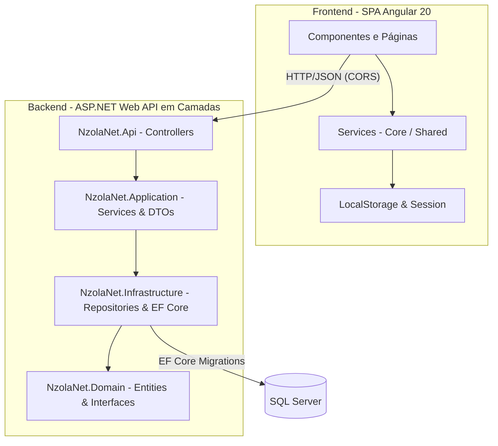

# 🌌 NzolaNet

[](https://angular.io/)
[](https://dotnet.microsoft.com/)
[](https://www.microsoft.com/sql-server)
[](https://playwright.dev/)

> **Rede social corporativa/académica** desenvolvida para a cadeira de **Aplicações Web** no **ISPTEC**.  
> Desenvolvida pelo **Grupo LODA** utilizando uma SPA em Angular no frontend, uma RESTful Web API em ASP.NET Core no backend, e persistência em SQL Server.

---

## ✨ Tema Visual: Fused "Carbon Aurora & Glassmorphic Twilight"
O **NzolaNet** implementa uma interface visual escura premium, inspirada nos modernos ambientes de desenvolvimento (como o tema Carbon) combinada com efeitos dinâmicos de luz aurora e transparências vidradas:
- **Canvas Principal**: `#07080A` (preto aurora profundo)
- **Superfícies (Cartões)**: `#0F1011` com efeito glassmorphic (desfoque de fundo e bordas translúcidas)
- **Destaques & Ações**: `#7170FF` (violeta aurora vibrante) e `#EC4899` (rosa de engajamento)
- **Tipografia**: Google Fonts **Inter** integrada globalmente para uma leitura limpa e profissional.

---

## 🏛️ Arquitetura do Sistema

O projeto adota uma separação rígida de responsabilidades, garantindo modularidade e independência tecnológica.



### Divisão das Camadas (Backend Clean Architecture):
1. **`NzolaNet.Domain`**: Contém as entidades de domínio (`User`, `Post`, `Comment`, `Follow`) e as interfaces dos repositórios.
2. **`NzolaNet.Application`**: Contém os DTOs de comunicação, mapeamentos (AutoMapper) e a lógica de negócio principal (Serviços).
3. **`NzolaNet.Infrastructure`**: Implementa o acesso a dados via EF Core, os repositórios reais, a segurança JWT e o armazenamento de uploads.
4. **`NzolaNet.Api`**: A camada de entrada com Controllers, gestão de CORS, middlewares de erro globais e documentação Swagger.

---

## 🛠️ Funcionalidades Implementadas (Âmbito da 2.ª Parcela + Extras)

### 👤 Utilizadores & Autenticação
- [x] Registo de novos utilizadores com encriptação automática de senhas.
- [x] Autenticação segura através de **Tokens JWT (Bearer)**.
- [x] Resgate de dados da sessão em tempo real através do endpoint `/api/auth/me`.
- [x] Edição de Perfil com atualização de Bio, Foto de Perfil e privacidade de conta.

### 🔒 Sistema de Privacidade & Relações
- [x] Opção de Perfil **Público** ou **Privado**.
- [x] Fluxo de **Seguir / Deixar de Seguir**.
- [x] Sistema de **Aprovação / Rejeição** de pedidos de seguimento para utilizadores privados na barra lateral, com transições dinâmicas.

### 📝 Publicações (Posts) & Interações
- [x] CRUD completo de publicações (Criar, Editar, Eliminar e Listar).
- [x] Suporte a uploads e anexos de multimédia (imagens e vídeos).
- [x] Lógica de **Feed Dinâmico**: O utilizador só visualiza publicações de perfis públicos ou de perfis privados que ele já segue e foi aprovado.
- [x] **Bazes (Gostos)**: Reações animadas com atualização de contadores em tempo real.
- [x] **Comentários**: Criação, edição e exclusão de comentários numa publicação.

### 🛡️ Administração & Moderação
- [x] Área administrativa autónoma para gestão de denúncias e bloqueios de segurança.

---

## 🚀 Como Executar o Projeto Localmente

### Pré-requisitos
- [.NET SDK 8.0](https://dotnet.microsoft.com/download) instalado.
- [Node.js LTS](https://nodejs.org/) instalado.
- **SQL Server** (LocalDB ou Express) ativo localmente.

### 1. Configurar e Executar o Backend
Abra um terminal na pasta raiz e execute:
```bash
cd backend
# Executa as migrações e atualiza a base de dados automaticamente no arranque (ou execute o comando abaixo se preferir)
dotnet ef database update --project NzolaNet.Infrastructure --startup-project NzolaNet.Api
# Inicia a API
dotnet run --project NzolaNet.Api
```
*O backend estará ativo em `http://localhost:5000` (e o Swagger em `http://localhost:5000/swagger`).*

### 2. Configurar e Executar o Frontend
Num novo terminal na pasta raiz, execute:
```bash
cd frontend
# Instala as dependências do Angular
npm install
# Inicia o servidor local
npm start
```
*Aceda ao frontend no browser através do link `http://localhost:4200`.*

---

## 🧪 Estrutura de Testes

### Testes Automatizados E2E (Playwright)
O projeto conta com uma suite completa de testes de ponta a ponta que valida toda a jornada do utilizador de forma automática (tema, login, criação de posts, pesquisa, perfil, notificações, etc.). 

Para correr os testes integrados:
```bash
cd frontend
npm run e2e
```
*Este script sobe o Angular e um Mock Backend temporários e corre os 11 testes integrados do Playwright em ambiente isolado.*

### Roteiro de Testes Manuais (Passo a Passo)
1. **Registo**: Aceda a `/registar`, crie um utilizador e valide o redirecionamento ao login.
2. **Privacidade**: Crie duas contas (`A` e `B`). Coloque a conta `B` como **Privada** nas configurações de perfil.
3. **Seguimento**: Com a conta `A`, pesquise por `B` e clique em **Seguir** (ficará com o estado *Pendente*).
4. **Aprovação**: Entre na conta `B` e aprove o pedido de `A` na lista lateral de pedidos.
5. **Feed & Baze**: Publique um post com a conta `B` e confirme que a conta `A` agora o visualiza no feed principal, podendo dar **Baze** e comentar.

---

## 👥 Equipa — Grupo LODA

| Membro | Stack de Atuação |
|---|---|
| 💻 **Willfredy Vieira Dias** | Backend (ASP.NET Core Web API + SQL Server) |
| 🎨 **Emer Tavares** | Frontend Angular (Autenticação + Perfil) |
| ⚡ **Jeovani Sassombo** | Frontend Angular (Publicações + Comentários) |
| 🌈 **Manuel Sulo** | Frontend Angular (Feed + Notificações + Design System) |

---
*Desenvolvido com dedicação académica e foco nas melhores práticas de engenharia de software.*
