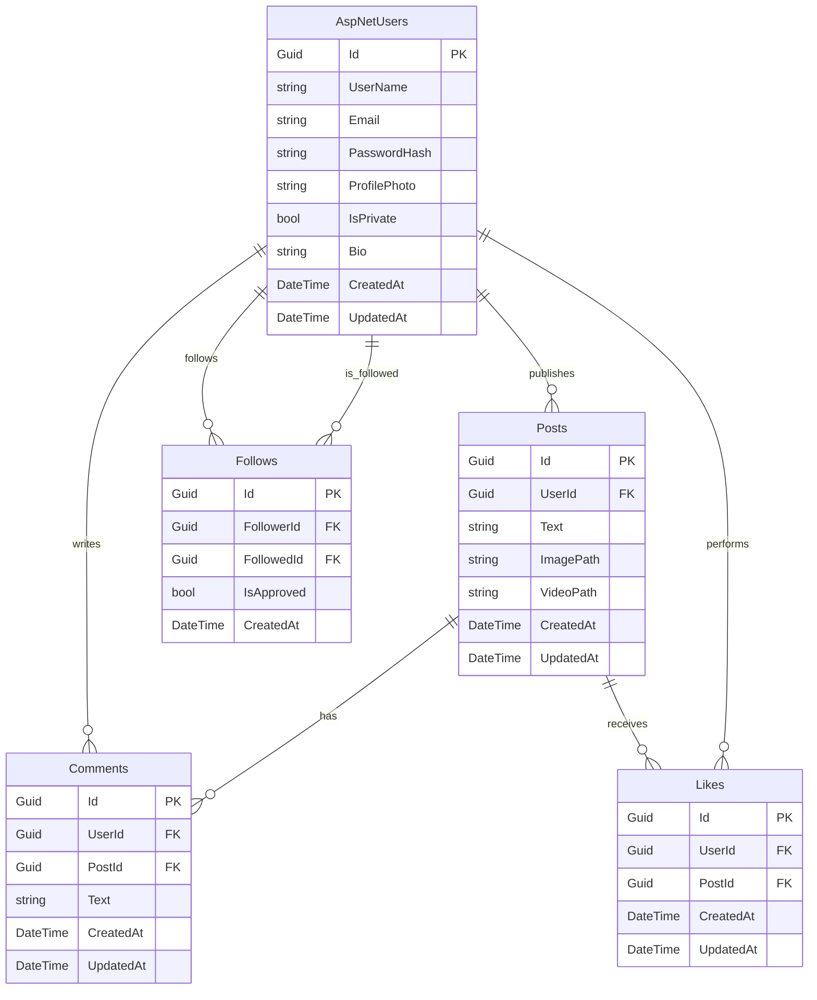

# Entity Relationship Diagram (ERD) — NzolaNet

Here is the Entity Relationship Diagram representing the NzolaNet platform database schema.

```mermaid
erDiagram
    AspNetUsers ||--o{ Posts : publishes
    AspNetUsers ||--o{ Comments : writes
    AspNetUsers ||--o{ Follows : follows
    AspNetUsers ||--o{ Follows : is_followed
    Posts ||--o{ Comments : has
    Posts ||--o{ Likes : receives
    AspNetUsers ||--o{ Likes : performs

    AspNetUsers {
        Guid Id PK
        string UserName
        string Email
        string PasswordHash
        string ProfilePhoto
        bool IsPrivate
        string Bio
        DateTime CreatedAt
        DateTime UpdatedAt
    }

    Posts {
        Guid Id PK
        Guid UserId FK
        string Text
        string ImagePath
        string VideoPath
        DateTime CreatedAt
        DateTime UpdatedAt
    }

    Comments {
        Guid Id PK
        Guid UserId FK
        Guid PostId FK
        string Text
        DateTime CreatedAt
        DateTime UpdatedAt
    }

    Follows {
        Guid Id PK
        Guid FollowerId FK
        Guid FollowedId FK
        bool IsApproved
        DateTime CreatedAt
    }

    Likes {
        Guid Id PK
        Guid UserId FK
        Guid PostId FK
        DateTime CreatedAt
        DateTime UpdatedAt
    }
```
